# CyberWiki

> Interaktywna baza wiedzy z zakresu cyberbezpieczeństwa — terminologia, taktyki, narzędzia.

**Live demo:** https://tpf-cyber-wiki.vercel.app

---

## Screenshoty aplikacji

### Strona główna
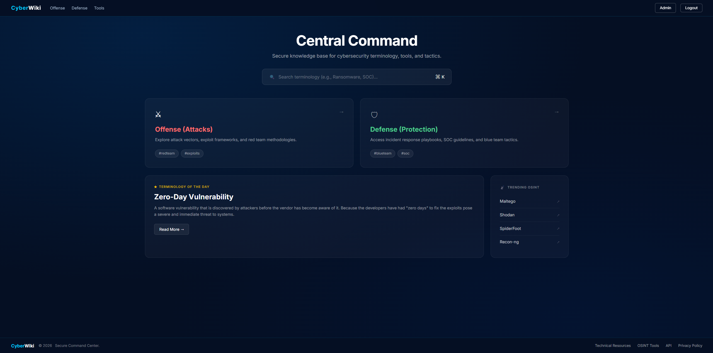

### Strona logowania
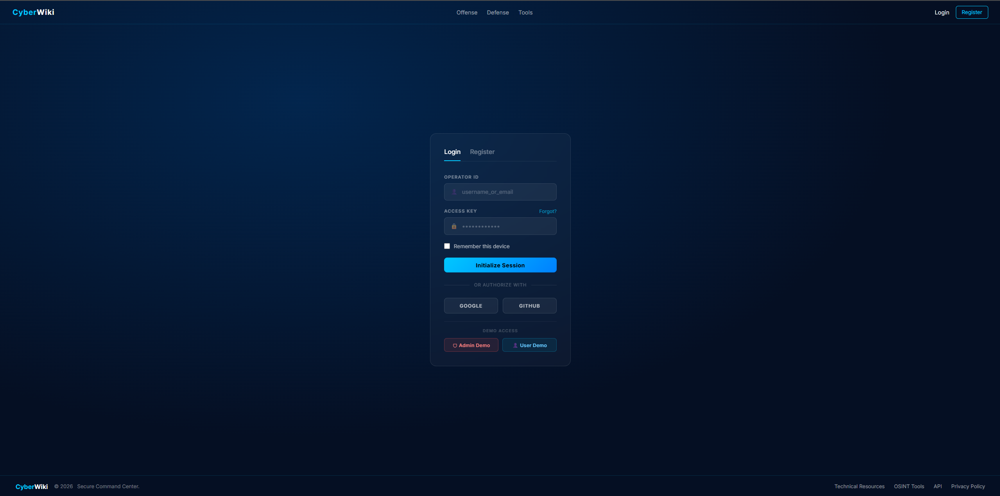

### Artykuły — Offense
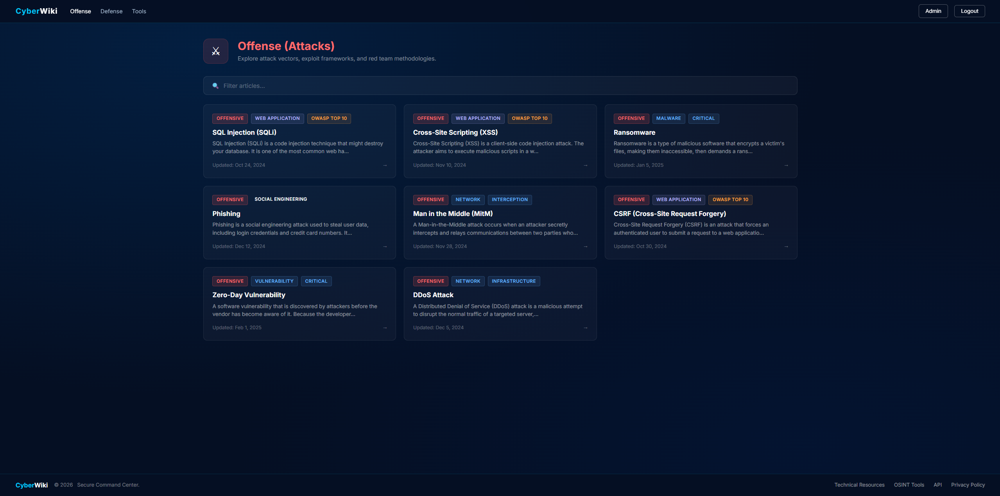

### Artykuły — Defense
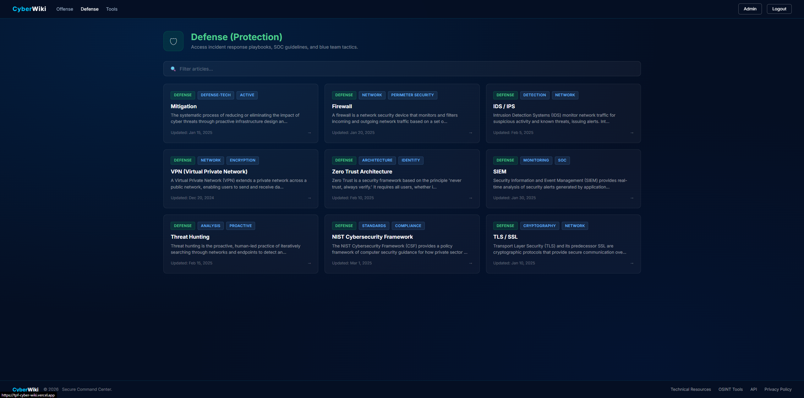

### Artykuł
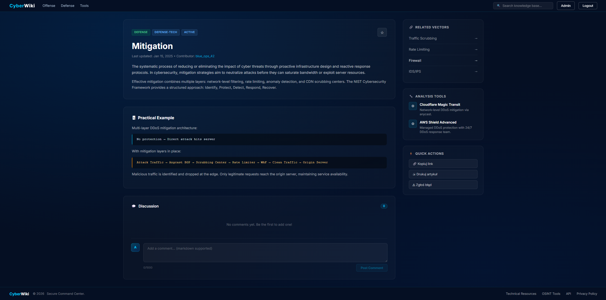

### Interaktywna mapa terminologii
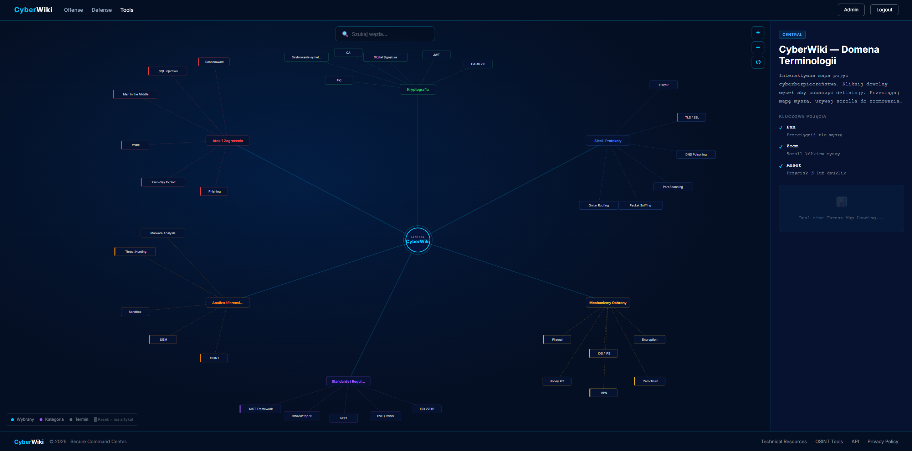

### Panel admina
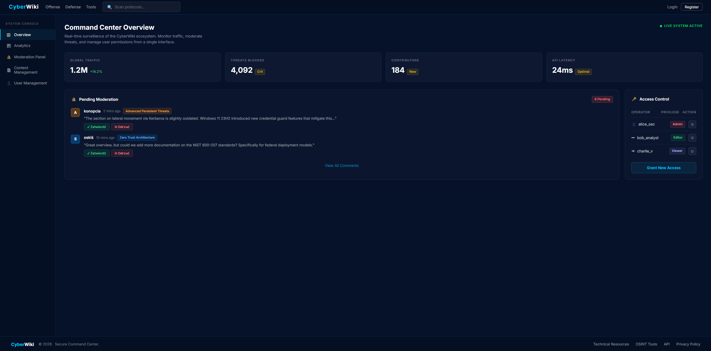

---

## Screenshoty Google Analytics

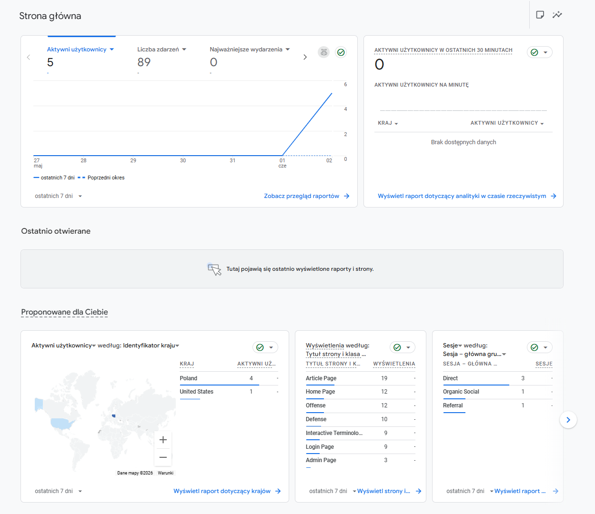

---

## Screenshoty Hotjar

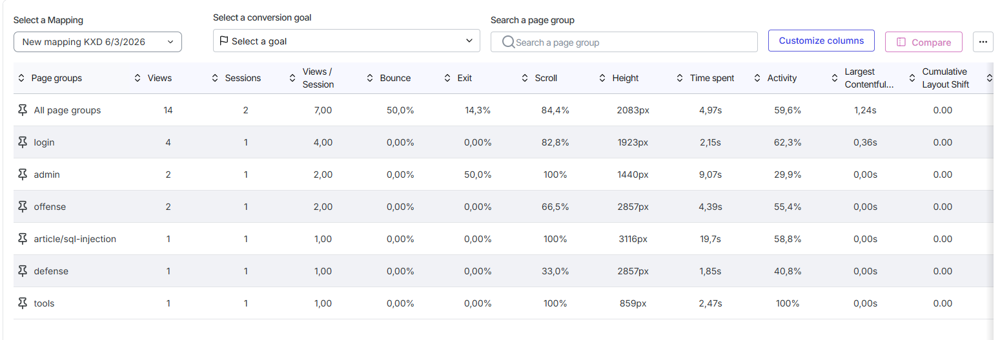

---

## Screenshoty Firebase

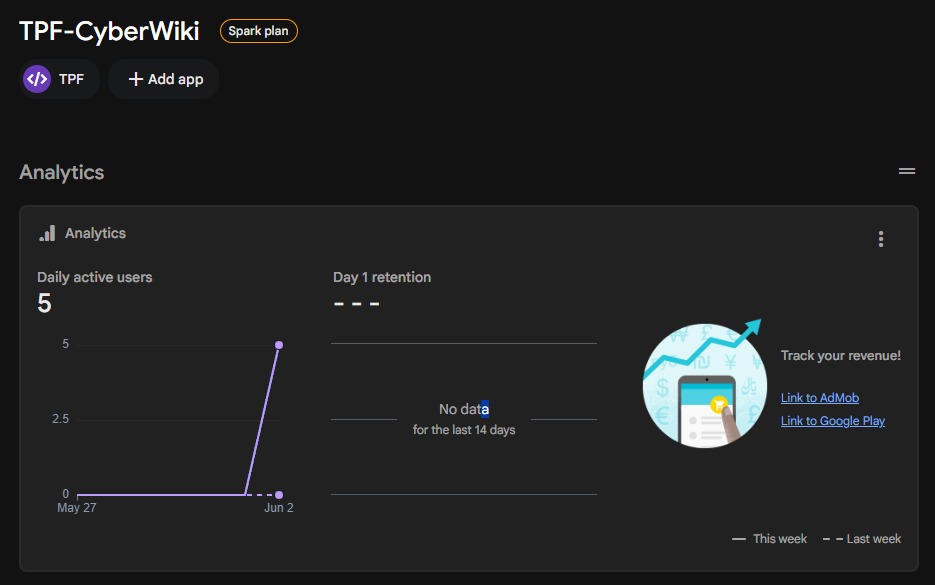

---

## Screenshoty Vercel (Deploy)

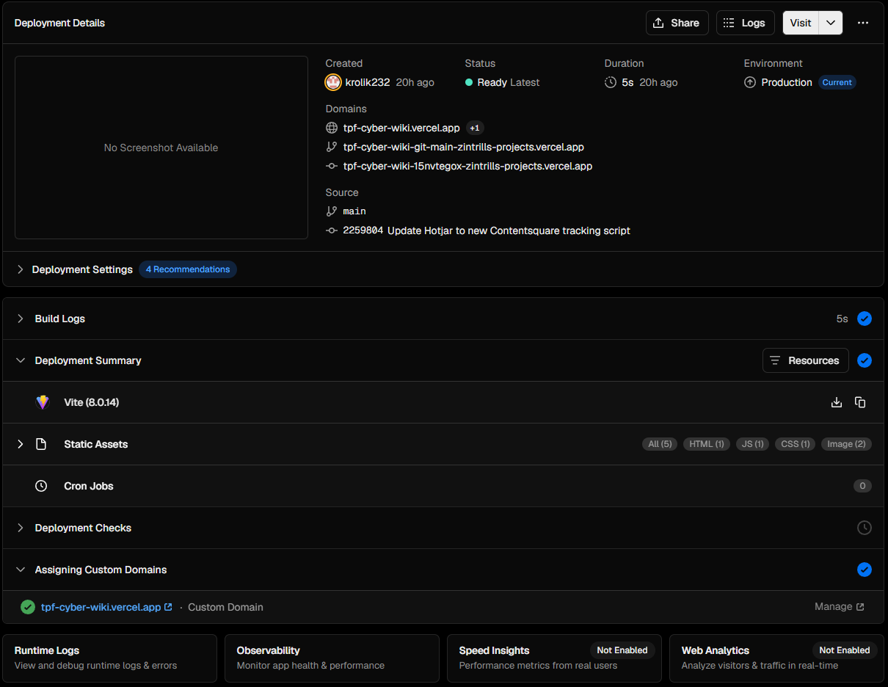

---

## Tech Stack

- **React 19** + **Vite**
- **React Router v7** — routing SPA
- **Firebase Authentication** — logowanie email/hasło, Google, GitHub
- **Hotjar / Contentsquare** — analiza zachowań użytkowników (heatmapy, nagrania sesji)
- **Google Analytics 4** (react-ga4) — śledzenie odsłon stron
- **Vercel** — hosting i automatyczny deploy z GitHub

---

## Struktura projektu

```
src/
  components/
    Navbar.jsx            # nawigacja górna (reużywalna)
    Footer.jsx            # stopka (reużywalna)
    Button.jsx            # przycisk (reużywalny)
    ArticleCard.jsx       # karta artykułu (reużywalna)
    Comments.jsx          # system komentarzy (reużywalny)
    AnalyticsListener.jsx # śledzenie GA4 przy zmianie trasy
    ProtectedRoute.jsx    # ochrona tras wymagających logowania
    Toast.jsx             # powiadomienia (reużywalne)
  pages/
    HomePage.jsx          # /
    LoginPage.jsx         # /login
    OffensePage.jsx       # /offense
    DefensePage.jsx       # /defense
    ToolsPage.jsx         # /tools — interaktywna mapa
    ArticlePage.jsx       # /article/:slug
    AdminPage.jsx         # /admin (chroniona)
    NotFoundPage.jsx      # * — 404
  data/
    articles.js           # baza artykułów (17 terminów)
  context/
    AuthContext.jsx       # kontekst Firebase Auth
  firebase.js             # inicjalizacja Firebase
  App.jsx                 # routing + inicjalizacja Hotjar i GA4
  main.jsx
```

---

## Trasy (React Router)

| Ścieżka | Widok |
|---------|-------|
| `/` | Strona główna — Central Command |
| `/login` | Logowanie / Rejestracja |
| `/offense` | Lista artykułów — Ataki |
| `/defense` | Lista artykułów — Obrona |
| `/tools` | Interaktywna mapa terminologii |
| `/article/:slug` | Pojedynczy artykuł |
| `/admin` | Panel admina (wymaga logowania) |
| `*` | 404 Not Found |

---

## Komponenty reużywalne

| Komponent | Użycie |
|-----------|--------|
| `Navbar` | Wszystkie strony |
| `Footer` | Wszystkie strony |
| `Button` | LoginPage, formularze |
| `ArticleCard` | OffensePage, DefensePage |
| `Comments` | ArticlePage |
| `ProtectedRoute` | Ochrona `/admin` |
| `Toast` | Powiadomienia w całej aplikacji |
| `AnalyticsListener` | Śledzenie GA4 na każdej trasie |

---

## Firebase Authentication

Aplikacja używa Firebase Authentication z obsługą:
- **Email + hasło** — główna metoda logowania
- **Google** — logowanie przez popup
- **GitHub** — logowanie przez popup
- **Chronione trasy** — `/admin` wymaga aktywnej sesji

Konto testowe: `admin@cyberwiki.com`

---

## Hotjar

Zintegrowany przez skrypt w `index.html` (Site ID: `856568`). Śledzi:
- Nagrania sesji użytkowników
- Heatmapy kliknięć i ruchu kursora
- Statystyki stron (Views, Sessions, Time spent, Scroll depth)

---

## Google Analytics 4

Zintegrowany przez pakiet `react-ga4` (Measurement ID: `G-TBJBJ0P6QY`). Śledzi:
- Odsłony wszystkich podstron (pageview przy każdej zmianie trasy)
- Źródła ruchu (Direct, Organic Social, Referral)
- Lokalizację użytkowników

---

## Uruchomienie lokalne

```bash
# 1. Zainstaluj zależności
npm install

# 2. Utwórz plik .env.local i uzupełnij danymi z Firebase
cp .env.example .env.local

# 3. Uruchom serwer deweloperski
npm run dev

# 4. Build produkcyjny
npm run build
```

### Zmienne środowiskowe (.env.local)

```
VITE_FIREBASE_API_KEY=
VITE_FIREBASE_AUTH_DOMAIN=
VITE_FIREBASE_PROJECT_ID=
VITE_FIREBASE_STORAGE_BUCKET=
VITE_FIREBASE_MESSAGING_SENDER_ID=
VITE_FIREBASE_APP_ID=
VITE_HOTJAR_SITE_ID=
VITE_GA_MEASUREMENT_ID=
```

---

## Deploy

Aplikacja jest wdrożona na **Vercel** z automatycznym deployem przy każdym pushu do brancha `main`.

Konfiguracja SPA routing: `vercel.json` przekierowuje wszystkie ścieżki na `index.html`.
